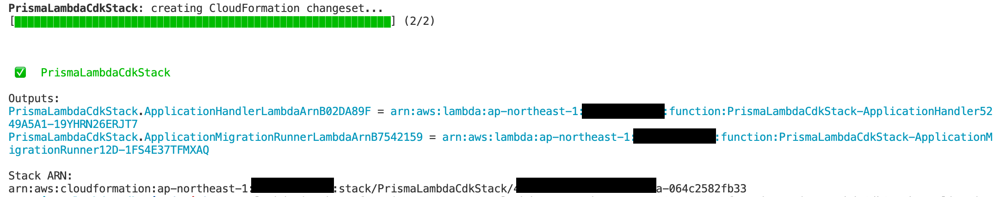

# Prisma + Lambda + CDK Sample
[](https://github.com/aws-samples/prisma-lambda-cdk/actions/workflows/build.yml)

This sample shows how to define a Lambda function which uses [Prisma](https://www.prisma.io/) by AWS Cloud Development Kit.

Prisma is an open source ORM for MySQL, PostgreSQL, etc written in TypeScript and very useful with its developer-friendly API and type safety.

By this sample, you can see how a Lambda function which uses Prisma can be deployed with CDK, how Prisma migration can be invoked from Lambda, and how Prisma works in Lambda.

[依存関係のバンドルに関する補足記事はこちら](https://tmokmss.hatenablog.com/entry/20220509/1652103822)。 (An additional article about bundling Node.js dependencies.)

## Architecture
This sample consists of the following AWS services:

* Amazon VPC
* Amazon Aurora MySQL
* AWS Lambda

There're two Lambda functions:

1. a function that reads and writes records from/to Amazon Aurora MySQL [`handler.ts`](backend/handler.ts)
2. a function that sets up a database and a table in it (a.k.a. schema migration) [`migration-runner.ts`](backend/migration-runner.ts)

We'll cover how you can use them in the following sections.

**NOTE**: This sample's architecture is for demonstration purpose only. You might need further improvement such as using [Amazon RDS Proxy](https://aws.amazon.com/rds/proxy/) before going to production.


## Deploy
Before deploying this sample, you must install AWS Cloud Development Kit prerequisites. [Please refer to this document](https://docs.aws.amazon.com/cdk/latest/guide/getting_started.html) for the detailed instruction. Make sure you've successfully completed `cdk bootstrap` step.

After that, clone this repository and `cd` to its root directory.

You must first install Node.js dependencies for CDK code by the following commands:

```sh
npm ci
```

Now you can deploy this sample's stack by the following command:

```sh
npx cdk deploy --require-approval never
```

Initial deployment usually takes about 20 minutes.

After a successful deployment, you can check the ARNs for two Lambda functions as the image below.  



Please take a note of the outputs below so that we can use them in the following section.

1. `PrismaLambdaCdkStack.ApplicationHandlerLambdaArn*`
2. `PrismaLambdaCdkStack.ApplicationMigrationRunnerLambdaArn*`

## Usage
To see how Prisma works with AWS Lambda, you can run the Lambda functions to apply database schema and get/create records for a sample table.

Although you can invoke a Lambda function from AWS Lambda management console, AWS SDK, AWS CLI, etc, we only cover AWS CLI way in this document. Please check [Developer Guide - Invoking AWS Lambda functions](https://docs.aws.amazon.com/lambda/latest/dg/lambda-invocation.html) for further information.

### Apply database schema
You must create a database and a table after provisioning an Aurora cluster. We use [Prisma Migrate](https://www.prisma.io/docs/concepts/components/prisma-migrate) to apply a database schema and run it from a Lambda function.

In this sample, migration is executed during CDK deployment using [cdk.Trigger](https://docs.aws.amazon.com/cdk/api/v2/docs/aws-cdk-lib.triggers.Trigger.html).

Instead, you can also run the migration outside of CDK, which is ideal for separating database migration from a CDK deployment.

You can invoke the migration function by the following command:

```sh
aws lambda invoke --function-name ApplicationMigrationRunnerLambdaArn response.json
```

Please replace `ApplicationMigrationRunnerLambdaArn` with the actual ARN you wrote down in the previous deployment step.

The invocation should complete in 10 seconds and return response `200`.
You can also check the detailed execution logs on Amazon CloudWatch Logs console.
Please refer to [Accessing Amazon CloudWatch logs for AWS Lambda](https://docs.aws.amazon.com/lambda/latest/dg/monitoring-cloudwatchlogs.html) for how to view logs for the Lambda functions.

Now that you successfully initalized a database and created a table, let's check if the system is working as expected by creating some records.

### Create records
You can create a record to the table by invoking another Lambda function by the following command:

```sh
aws lambda invoke --function-name ApplicationHandlerLambdaArn /dev/stdout
```

Please replace `ApplicationHandlerLambdaArn` with the actual ARN you wrote down in the previous deployment step.

You can see [`prisma.schema`](backend/prisma/schema.prisma) and [`handler.ts`](backend/handler.ts) to guess what record is created.

### Get records
You can get records by invoking the Lambda function that we invoked in the last step with a different parameter:

```sh
aws lambda invoke --function-name ApplicationHandlerLambdaArn --cli-binary-format raw-in-base64-out --payload '{"command":"get"}' response.json
```

**NOTE**: You would't need `cli-binary-format` parameter if you use AWS CLI v1.

Check `response.json` and see the records you created.

### (Optional) Using Postgres
If you want to use Postgres instead of MySQL, you must change the following code:

* [`backend/prisma/schema.prisma`](backend/prisma/schema.prisma)
  * Set `provider` to `postgresql`
* [`backend/prisma/.env`](backend/prisma/.env)
  * Replace `DATABASE_ENGNIE` to `postgres` and `DATABASE_PORT` to `5432` (or a port number you use)
* [`lib/construct/database.ts`](lib/construct/database.ts)
  * Set `engine` to a postgres version you want to use
    * Please refer to [class `AuroraPostgresEngineVersion` document](https://docs.aws.amazon.com/cdk/api/v2/docs/aws-cdk-lib.aws_rds.AuroraPostgresEngineVersion.html) for the available values
  * Set Database parameter group for closing idle connection ([`idle_session_timeout`](https://www.postgresql.org/docs/current/runtime-config-client.html#GUC-IDLE-SESSION-TIMEOUT))

**NOTE**: Not all the combination of DB instance types and DB engines are supported in Amazon Aurora.
Please check [Supported DB engines for DB instance classes](https://docs.aws.amazon.com/AmazonRDS/latest/AuroraUserGuide/Concepts.DBInstanceClass.html#Concepts.DBInstanceClass.SupportAurora) and set `instanceType` accordingly.

After that, you must generate migration and re-deploy the system. Please run the following commands:

```sh
cd backend
# run a local postgres server
docker-compose up

# remove existing migrations directory
rm -rf prisma/migrations

# generate migration files
npx prisma migrate dev --name initial-state

# cd to CDK root directory
cd ../
# destroy old stack if any
npx cdk destroy --force
# deploy the new postgres system
npx cdk deploy
```


## How it works
### Lambda deployment
The Lambda functions which use Prisma library are deployed by [a CDK construct named `NodeJsFunction`](https://docs.aws.amazon.com/cdk/api/latest/docs/@aws-cdk_aws-lambda-nodejs.NodejsFunction.html) (see [PrismaFunction class](lib/construct/prisma-function.ts)).
This construct bundles TypeScript code into a single JavaScript file with its dependencies, making it an easily-deployable package.

However, code that uses Prisma cannot be bundled into a single .js file because it depends on a native binary of [query engine](https://www.prisma.io/docs/concepts/components/prisma-engines/query-engine). To bundle them, we specify Prisma packages (`prisma` and `@prisma/client`) as `externalModules` explicitly. By this declaration, Prisma is installed into an external `node_modules` directory with the native binary.
In addition, when you run `npm install`, Prisma choose the correct binary platform of query engine for the runtime environment. Because the entire build process is run on a Docker container which is equivalent to Lambda Node.js environment, you don't have to care about what platform you run this CDK app on.

When `npm install`, Prisma searches `schema.prisma`, and if found, it generates client code from the schema file automatically.
That's why we copy `schema.prisma` before `npm install` by specifying [`ICommandHooks.beforeInstall`](https://docs.aws.amazon.com/cdk/api/latest/docs/@aws-cdk_aws-lambda-nodejs.ICommandHooks.html).

Finally, you must copy also `.env` file to load `DATABASE_URL` environment variable. If there's any `.env` file when running `npm install`, Prisma "marks" it and loads it automatically at runtime.

### Using Docker Lambda
If you think the above process to bundle Node.js code into a zip file with prisma dependencies too complex and difficult to manage, Docker Lambda is a way to go. 

Using Docker container, the bundling process becomes much simpler; you don't need to hack `NodejsFunction` to properly install `@prisma/client` package, and you can just install all the dependencies with `npm ci`. 

Another advantage of Docker bundling is that build process is much faster than `NodejsFuntion`. With `NodejsFunction`, `npm ci` runs every time we synthesize CDK assembly and it takes 30~60 seconds to finish, whereas with Docker bundling `npm ci` runs only when `package-lock.json` or `schema.prisma` changes. When we build CDK frequently for example with `cdk watch`, the difference will become very huge.

You can try Docker bundling easily with this sample. The Dockerfile is located at [`backend/Dockerfile`](./backend/Dockerfile), and the actual construct to define Docker Lambda functions are in [`lib/construct/application.ts`](lib/construct/application.ts).

### Schema migration
When you want to modify `prisma.schema`, you can apply the changes with the following steps:

First, you must generate migration files by the following command:

```sh
cd backend

# replace MIGRATION_NAME with a meaningful name 
npx prisma migrate dev --name MIGRATION_NAME
```

The generated migration files should be placed on `backend/prisma/migration` directory. After you confirm new migration files generated, you can deploy them to AWS Lambda by the following command:

```sh
# cd to CDK root directory
cd ../

npx cdk deploy --require-approval never
```

Now you can apply the migration by invoking the Lambda function:

```sh
aws lambda invoke --function-name ApplicationMigrationRunnerLambdaArn /dev/stdout
```

This is how you can modify database schema in a production-ready way. You can also invoke the Lambda function from a CI/CD pipeline.

Instead of the above procedure, you can apply schema changes in a destructive way. This is particularly useful if you are in a PoC phase and don't need keep data in your database.

```sh
cd backend

# remove old migration files
rm -rf prisma/migration
# remove old database
npx prisma migrate reset
# create new migration files
npx prisma migrate dev --name initial-state

# cd to CDK root directory
cd ../
# deploy Lambda functions with the new migration files
npx cdk deploy --require-approval never

# execute after deployment
aws lambda invoke --function-name ApplicationMigrationRunnerLambdaArn --cli-binary-format raw-in-base64-out --payload '{"command":"reset"}' /dev/stdout
```

By sending `reset` command to the migration Lambda function, it executes `prisma migrate reset`, which removes old databases and creates new one with the new table schema.  

### Access to database
You can access a database from a Lambda function the same way as other ordinary Prisma applications.  
Please check the actual code [`handler.ts`](backend/handler.ts) to see how you can use Prisma in AWS Lambda.

There is additional things you might want to consider, for example, database connection management on serverless environment. Please check the following documents for further information: [Prisma - Connection management](https://www.prisma.io/docs/guides/performance-and-optimization/connection-management/#serverless-environments-faas), [Using Amazon RDS Proxy with AWS Lambda](https://aws.amazon.com/blogs/compute/using-amazon-rds-proxy-with-aws-lambda/)

### Using Prisma with Aurora Serverless v2 scaling to zero

When you use Prisma with [Aurora Serverless v2 automatic pause feature](https://aws.amazon.com/blogs/database/introducing-scaling-to-0-capacity-with-amazon-aurora-serverless-v2/), you may want to configure the following:

1. **set idle connection timeout on RDB side to lower value**: Aurora will scale in to zero capacity when there is no active connection. That is why when connection is live in a connection pool, it does not scale to zero. DB Parameters like [`wait_timeout`](https://dev.mysql.com/doc/refman/8.4/en/server-system-variables.html#sysvar_wait_timeout) allows it to automatically close idle connections, letting Aurora Serverless v2 scale in within the desired period.
2. **set connection timeout on Prisma side to higher value**: When Aurora scales up from zero capacity, it takes up to 15 seconds before accepting a connection. Prisma must wait more than the period when it spins up a new connection. You can set `pool_timeout` and `connect_timeout` ([MySQL](https://www.prisma.io/docs/orm/overview/databases/mysql#arguments), [Postgres](https://www.prisma.io/docs/orm/overview/databases/postgresql#arguments)).

All of the above are already configured in this repo. You can check `database.ts` and `prisma-function.ts` to see how it is working.

## Clean up
To avoid incurring future charges, clean up the resources you created.

You can remove all the AWS resources deployed by this sample running the following command:

```sh
npx cdk destroy --force
```

## Security

See [CONTRIBUTING](CONTRIBUTING.md#security-issue-notifications) for more information.

## License

This library is licensed under the MIT-0 License. See the LICENSE file.
